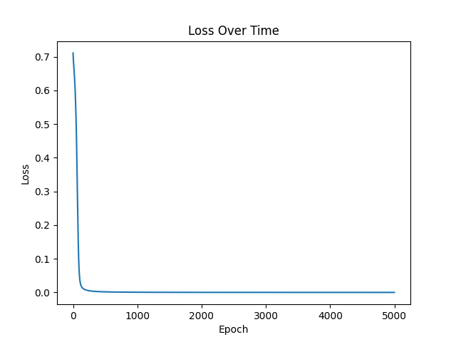

# 🧠 XOR Neural Network (Keras + TensorFlow)

This project implements a small neural network that learns the **XOR logic gate** using **Keras** and **TensorFlow**.
It’s often called the “Hello World” of neural networks — simple, fast, and the perfect place to start learning AI.

---

## 💡 What is XOR?

The XOR (exclusive OR) gate outputs **1** only when the two inputs are *different*.

|  A  |  B  | A XOR B |
| :-: | :-: | :-----: |
|  0  |  0  |    0    |
|  0  |  1  |    1    |
|  1  |  0  |    1    |
|  1  |  1  |    0    |

---

## ⚙️ Model Architecture

| Layer | Type   | Activation | Units |
| ----- | ------ | ---------- | ----- |
| 1     | Input  | —          | 2     |
| 2     | Dense  | `tanh`     | 4     |
| 3     | Dense  | `tanh`     | 4     |
| 4     | Output | `sigmoid`  | 1     |

**Optimiser:** Adam (`learning_rate=0.01`)
**Loss Function:** Binary Cross-Entropy
**Epochs:** 5000
**Batch Size:** 4

---

## 🧮 Training Results

After training, the model learns to correctly reproduce XOR logic:

```
Raw: [0.02, 0.98, 0.97, 0.01]
Rounded: [0, 1, 1, 0]
```

### 📈 Loss Curve



---

## 🧰 Requirements

Install dependencies with pip:

```bash
pip install -r requirements.txt
```

---

## ▶️ Run the Project

```bash
python nnxor.py
```

---

## 👤 Author

**Lucian Procopciuc**
MSc Software Development · University of Glasgow (2024)

